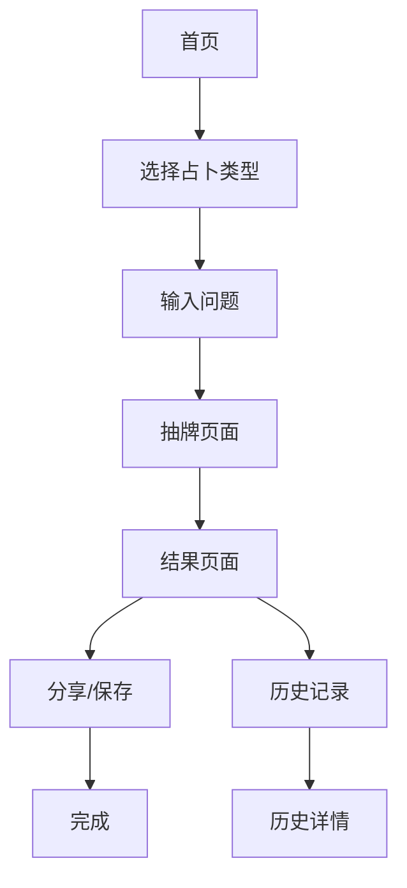

## 1. 产品概述
AI塔罗牌占卜小程序是一款结合人工智能技术的塔罗牌占卜应用，为用户提供个性化、智能化的塔罗牌占卜服务。用户可以通过小程序进行塔罗牌占卜，获得AI解读的占卜结果，帮助用户探索内心、指引方向。

产品目标是为用户提供便捷、准确的塔罗牌占卜体验，通过AI技术提升传统塔罗牌占卜的准确性和个性化程度，打造移动端占卜服务的新体验。

## 2. 核心功能

### 2.1 用户角色
| 角色 | 注册方式 | 核心权限 |
|------|----------|----------|
| 普通用户 | 微信小程序授权登录 | 进行占卜、查看历史记录、分享结果 |
| VIP用户 | 微信小程序授权+付费升级 | 无限次占卜、专属牌阵、详细解读报告 |

### 2.2 功能模块
AI塔罗牌占卜小程序包含以下核心页面：
1. **首页**：占卜入口、牌阵选择、历史记录入口
2. **占卜页面**：抽牌过程、牌面展示、AI解读
3. **结果页面**：占卜结果展示、详细解读、分享功能
4. **个人中心**：用户信息、历史记录、VIP升级
5. **牌意库**：塔罗牌知识库、牌意查询

### 2.3 页面详情
| 页面名称 | 模块名称 | 功能描述 |
|----------|----------|----------|
| 首页 | 占卜入口 | 提供多种占卜方式入口（单张牌、三张牌、凯尔特十字等） |
| 首页 | 牌阵选择 | 展示不同牌阵类型，用户可选择占卜问题类型 |
| 首页 | 历史记录 | 显示用户最近的占卜记录，可点击查看详情 |
| 占卜页面 | 抽牌动画 | 展示洗牌、切牌、抽牌的动画效果 |
| 占卜页面 | 牌面展示 | 显示抽到的塔罗牌正逆位状态 |
| 占卜页面 | AI解读 | 基于牌阵和问题类型，AI生成个性化解读 |
| 结果页面 | 结果展示 | 完整展示占卜结果，包括牌面含义和建议 |
| 结果页面 | 分享功能 | 生成分享卡片，支持分享到朋友圈或好友 |
| 个人中心 | 用户信息 | 显示用户昵称、头像、会员状态 |
| 个人中心 | 历史记录 | 按时间顺序展示所有占卜记录 |
| 个人中心 | VIP升级 | 展示VIP权益，提供付费升级入口 |
| 牌意库 | 牌意查询 | 可查询78张塔罗牌的详细含义 |
| 牌意库 | 分类浏览 | 按大阿卡纳、小阿卡纳分类浏览 |

## 3. 核心流程

### 普通用户流程
用户进入小程序 → 选择占卜类型 → 输入占卜问题 → 进行抽牌 → 查看AI解读结果 → 分享或保存结果 → 查看历史记录

### VIP用户流程
用户进入小程序 → 选择高级牌阵 → 输入详细问题 → 进行完整抽牌 → 获取详细AI解读报告 → 下载完整报告 → 享受专属功能

## 4. 用户界面设计

### 4.1 设计风格
- **主色调**：神秘紫色（#6B46C1）搭配金色（#FFD700）
- **辅助色**：深紫色（#4C1D95）、浅紫色（#E9D5FF）
- **按钮风格**：圆角设计，带有渐变效果
- **字体**：中文使用思源黑体，英文使用Montserrat
- **布局风格**：卡片式布局，突出神秘感
- **图标风格**：线性图标，配合神秘主题

### 4.2 页面设计概述
| 页面名称 | 模块名称 | UI元素 |
|----------|----------|--------|
| 首页 | 占卜入口 | 紫色渐变背景，金色按钮，神秘星空元素 |
| 占卜页面 | 抽牌动画 | 3D翻牌效果，神秘粒子动画 |
| 结果页面 | 结果展示 | 卡片式布局，金色边框，神秘符文装饰 |
| 个人中心 | 用户信息 | 简洁卡片设计，紫色主题 |
| 牌意库 | 牌面展示 | 网格布局，悬停效果显示牌意 |

### 4.3 响应式设计
- 适配微信小程序标准尺寸
- 支持iPhone和Android主流机型
- 优化触摸交互体验
- 考虑不同屏幕尺寸的适配方案