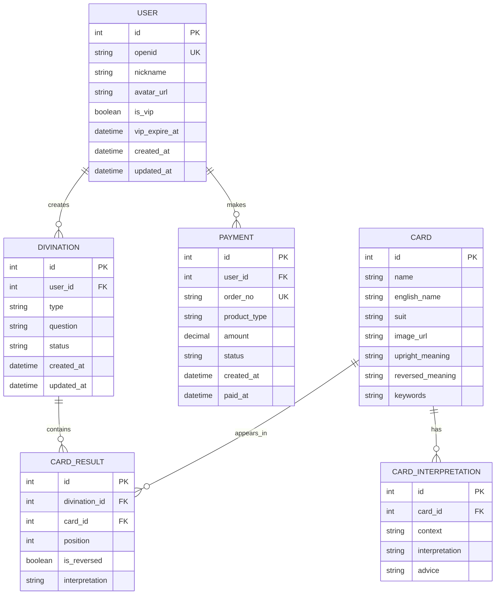

## 1. 架构设计


## 2. 技术描述

### 前端技术栈
- **框架**: 微信小程序原生框架
- **UI组件**: Vant Weapp组件库
- **状态管理**: 小程序原生storage + 全局状态管理
- **网络请求**: 小程序原生request API
- **动画效果**: CSS3动画 + 小程序动画API

### 后端技术栈
- **运行环境**: Node.js 18+
- **Web框架**: Express.js 4.18+
- **数据库**: MySQL 8.0
- **缓存**: Redis 6.0
- **AI服务**: OpenAI GPT-4 API, Claude API
- **身份验证**: JWT + 微信小程序登录
- **文件存储**: 阿里云OSS / 腾讯云COS

### 开发工具
- **前端开发**: 微信开发者工具
- **后端开发**: VSCode + ESLint
- **API测试**: Postman
- **数据库管理**: Navicat / MySQL Workbench

## 3. 路由定义

### 小程序页面路由
| 路由 | 页面名称 | 功能描述 |
|------|----------|----------|
| /pages/index/index | 首页 | 小程序主入口，展示占卜选项 |
| /pages/divination/divination | 占卜页面 | 进行塔罗牌占卜抽牌 |
| /pages/result/result | 结果页面 | 展示占卜结果和AI解读 |
| /pages/profile/profile | 个人中心 | 用户信息和个人设置 |
| /pages/history/history | 历史记录 | 查看占卜历史 |
| /pages/cards/cards | 牌意库 | 塔罗牌知识库 |
| /pages/vip/vip | VIP页面 | 会员权益和升级 |

### 后端API路由
| 路由 | 请求方式 | 功能描述 |
|------|----------|----------|
| /api/auth/login | POST | 微信小程序登录 |
| /api/divination/create | POST | 创建新的占卜 |
| /api/divination/result | GET | 获取占卜结果 |
| /api/divination/history | GET | 获取用户历史记录 |
| /api/ai/interpret | POST | AI解读塔罗牌 |
| /api/cards/list | GET | 获取塔罗牌列表 |
| /api/cards/detail | GET | 获取单张牌详情 |
| /api/user/profile | GET | 获取用户信息 |
| /api/user/update | PUT | 更新用户信息 |
| /api/payment/create | POST | 创建VIP订单 |

## 4. API定义

### 4.1 核心API接口

#### 微信小程序登录
```
POST /api/auth/login
```

请求参数：
| 参数名 | 类型 | 必填 | 描述 |
|--------|------|------|------|
| code | string | 是 | 微信登录code |
| userInfo | object | 是 | 用户信息对象 |

响应参数：
| 参数名 | 类型 | 描述 |
|--------|------|------|
| token | string | JWT令牌 |
| userId | string | 用户ID |
| isVip | boolean | 是否VIP用户 |

#### 创建占卜
```
POST /api/divination/create
```

请求参数：
| 参数名 | 类型 | 必填 | 描述 |
|--------|------|------|------|
| type | string | 是 | 占卜类型（single, three, celtic） |
| question | string | 是 | 占卜问题 |
| cards | array | 是 | 抽到的牌数组 |

响应参数：
| 参数名 | 类型 | 描述 |
|--------|------|------|
| divinationId | string | 占卜记录ID |
| status | string | 处理状态 |

#### AI解读接口
```
POST /api/ai/interpret
```

请求参数：
| 参数名 | 类型 | 必填 | 描述 |
|--------|------|------|------|
| cards | array | 是 | 牌面信息数组 |
| question | string | 是 | 用户问题 |
| type | string | 是 | 占卜类型 |

响应参数：
| 参数名 | 类型 | 描述 |
|--------|------|------|
| interpretation | string | AI解读内容 |
| advice | string | 建议内容 |
| keywords | array | 关键词数组 |

## 5. 服务器架构


## 6. 数据模型

### 6.1 实体关系图



### 6.2 数据定义语言

#### 用户表 (users)
```sql
CREATE TABLE users (
    id INT PRIMARY KEY AUTO_INCREMENT,
    openid VARCHAR(100) UNIQUE NOT NULL COMMENT '微信openid',
    nickname VARCHAR(100) COMMENT '用户昵称',
    avatar_url VARCHAR(500) COMMENT '头像URL',
    is_vip BOOLEAN DEFAULT FALSE COMMENT '是否VIP',
    vip_expire_at DATETIME COMMENT 'VIP到期时间',
    created_at DATETIME DEFAULT CURRENT_TIMESTAMP,
    updated_at DATETIME DEFAULT CURRENT_TIMESTAMP ON UPDATE CURRENT_TIMESTAMP,
    INDEX idx_openid (openid),
    INDEX idx_vip_status (is_vip)
) ENGINE=InnoDB DEFAULT CHARSET=utf8mb4 COMMENT='用户表';
```

#### 占卜记录表 (divinations)
```sql
CREATE TABLE divinations (
    id INT PRIMARY KEY AUTO_INCREMENT,
    user_id INT NOT NULL COMMENT '用户ID',
    type VARCHAR(50) NOT NULL COMMENT '占卜类型',
    question TEXT COMMENT '占卜问题',
    status VARCHAR(20) DEFAULT 'pending' COMMENT '状态',
    ai_interpretation TEXT COMMENT 'AI解读内容',
    created_at DATETIME DEFAULT CURRENT_TIMESTAMP,
    updated_at DATETIME DEFAULT CURRENT_TIMESTAMP ON UPDATE CURRENT_TIMESTAMP,
    FOREIGN KEY (user_id) REFERENCES users(id),
    INDEX idx_user_id (user_id),
    INDEX idx_status (status),
    INDEX idx_created_at (created_at)
) ENGINE=InnoDB DEFAULT CHARSET=utf8mb4 COMMENT='占卜记录表';
```

#### 塔罗牌表 (cards)
```sql
CREATE TABLE cards (
    id INT PRIMARY KEY AUTO_INCREMENT,
    name VARCHAR(100) NOT NULL COMMENT '牌名',
    english_name VARCHAR(100) COMMENT '英文名',
    suit VARCHAR(50) COMMENT '牌组',
    number INT COMMENT '编号',
    image_url VARCHAR(500) COMMENT '图片URL',
    upright_meaning TEXT COMMENT '正位含义',
    reversed_meaning TEXT COMMENT '逆位含义',
    keywords TEXT COMMENT '关键词',
    created_at DATETIME DEFAULT CURRENT_TIMESTAMP,
    INDEX idx_suit (suit),
    INDEX idx_name (name)
) ENGINE=InnoDB DEFAULT CHARSET=utf8mb4 COMMENT='塔罗牌表';
```

#### 卡牌结果表 (card_results)
```sql
CREATE TABLE card_results (
    id INT PRIMARY KEY AUTO_INCREMENT,
    divination_id INT NOT NULL COMMENT '占卜记录ID',
    card_id INT NOT NULL COMMENT '卡牌ID',
    position INT NOT NULL COMMENT '位置',
    is_reversed BOOLEAN DEFAULT FALSE COMMENT '是否逆位',
    interpretation TEXT COMMENT '解读内容',
    created_at DATETIME DEFAULT CURRENT_TIMESTAMP,
    FOREIGN KEY (divination_id) REFERENCES divinations(id),
    FOREIGN KEY (card_id) REFERENCES cards(id),
    INDEX idx_divination_id (divination_id),
    INDEX idx_card_id (card_id)
) ENGINE=InnoDB DEFAULT CHARSET=utf8mb4 COMMENT='卡牌结果表';
```

#### 支付记录表 (payments)
```sql
CREATE TABLE payments (
    id INT PRIMARY KEY AUTO_INCREMENT,
    user_id INT NOT NULL COMMENT '用户ID',
    order_no VARCHAR(100) UNIQUE NOT NULL COMMENT '订单号',
    product_type VARCHAR(50) NOT NULL COMMENT '产品类型',
    amount DECIMAL(10,2) NOT NULL COMMENT '金额',
    status VARCHAR(20) DEFAULT 'pending' COMMENT '状态',
    transaction_id VARCHAR(100) COMMENT '微信交易号',
    created_at DATETIME DEFAULT CURRENT_TIMESTAMP,
    paid_at DATETIME COMMENT '支付时间',
    FOREIGN KEY (user_id) REFERENCES users(id),
    INDEX idx_user_id (user_id),
    INDEX idx_order_no (order_no),
    INDEX idx_status (status)
) ENGINE=InnoDB DEFAULT CHARSET=utf8mb4 COMMENT='支付记录表';
```

## 7. AI服务集成方案

### 7.1 AI服务架构
- **主服务**: OpenAI GPT-4 API
- **备用服务**: Claude API
- **缓存策略**: Redis缓存相似问题的解读结果
- **失败重试**: 自动切换备用服务

### 7.2 提示词设计
```javascript
const promptTemplate = `
你是一位经验丰富的塔罗牌占卜师。用户抽到了以下牌面：

牌阵类型：{divinationType}
用户问题：{userQuestion}
抽到的牌：{cards}

请根据塔罗牌的传统含义，结合用户的问题，给出专业的解读和建议。
解读应该：
1. 准确解释每张牌的含义
2. 分析牌阵的整体意义
3. 针对用户问题给出具体建议
4. 语言要温暖、积极、有启发性

请用中文回答，字数在300-500字之间。
`;
```

### 7.3 错误处理
- API调用超时处理
- 内容过滤和安全检查
- 异常情况降级处理
- 用户友好的错误提示